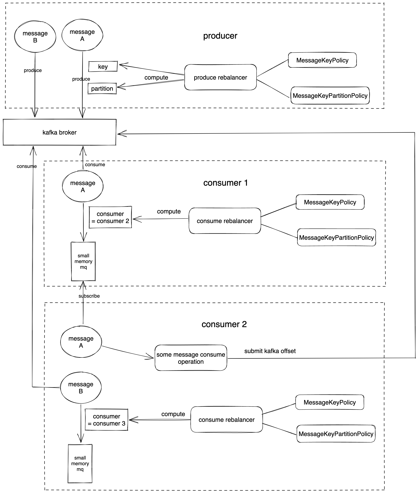
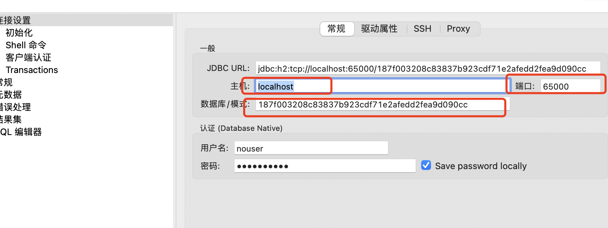

**kafka消息处理rebalance中间件**

# 说明介绍

在基于kafka消息消费的处理中，常常需要做到唯一实体访问做并发限制，以保证数据的一致性，通常采用分布式锁的方式实现(基于数据库或缓存的悲观/乐观锁等)。在数据量大的情况，这样的实现代价是很大的，基本上倾向于采用无锁的方式(事件驱动+actor 模型等) 方式，但是这需要在业务层面进行设计(将原来的kafka消息设计成event, 通过一定规则做event的处理和容错)。如何在不改造业务的情况下，既能通过无锁的方式消费kafka消息，又能保证数据一致性是一个很强烈的技术需求。

通常可以通过produce端的rebalance，在消息生产时预指定partition，一个partition只在一个consumer client上消费的情况，唯一实体的消息处理可以都在一个线程中，降低锁频率。但这并不是所有场景都适用的准则，在某些业务场景下预指定partition会导致partition间数据分布不均衡，从而使得某个consumer处理的partition产生积压，而另外的consumer大部分时间都空闲。本项目在此基础之上，引入了消费端的rebalance逻辑，让每个consumer处理的消息数都保持大致相同，提高服务器资源使用率。

# 设计

整体架构如下：

目标：提高kafka消息消费场景下，消息处理的整体吞吐量，并降低服务器资源使用

# 使用：

编译打包：

```
mvn clean package -DskipTests
```

启动

```
java -jar target/kafka-rebalancer.jar
```

依赖服务项

* kafka(listen on 9092)
* redis(listen on 6379, no password)
* h2(jdbc:h2:/tmp/kafka-rebalancer/data:public)

测试

1. 查看内嵌h2数据库表结构
   通过jdbc连上服务内嵌h2数据库, 链接参数如下：

   

   **"需注意数据库模式是一个唯一字符串", 可以直接通过cat h2 lock文件获取，比如：**

   `cat /tmp/kafka-rebalancer/data:public.lock.db |grep id `
2. 根据表结构创建mock数据

   `curl -XPOST 'http://localhost:50505/kafka-rebalancer/produce/mock/test-data' -H 'content-type:application/json' -d '{"field1":"1", "value1":"value1", "uniq_field2":8}'`
3. 模拟本地pull

   `curl 'http://localhost:50505/kafka-rebalancer/pull/test-data/local'`
4. 查看内嵌h2数据库中数据是否已经落库

   `select * from public.test_data limit 1000;`
